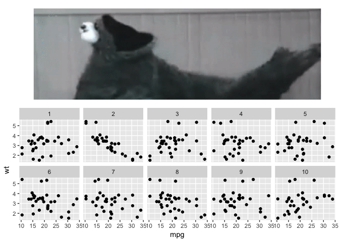
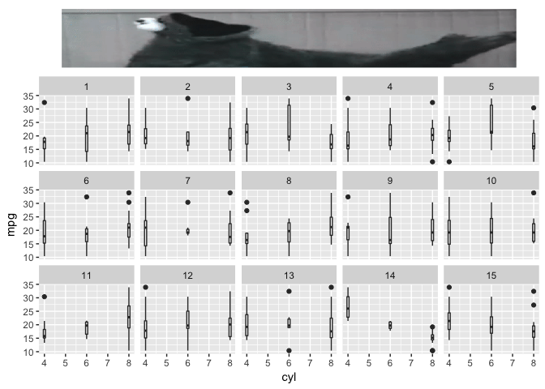
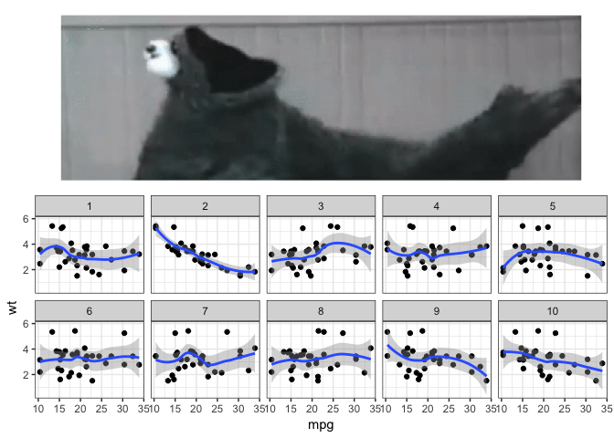

<!-- README.md is generated from README.Rmd. Please edit that file -->
cookiemonster
=============

The goal of **cookiemonster** is to add a festive picture of Cookie Monster above a line-up protocol plot, in reference to [Graphical inference](https://www.youtube.com/watch?v=rEHKm3Z1zUE) by Hadley Wickham.

This small package would not have been here without [Thomas Lin Pedersen's](https://twitter.com/thomasp85) [patchwork](https://github.com/thomasp85/patchwork).

Installation
------------

This package depends on the development package `patchwork` which is not yet on CRAN. But can be downloaded from github.

``` r
# install.packages("devtools")
devtools::install_github("thomasp85/patchwork")
```

You can install **cookiemonster** from github with:

``` r
# install.packages("devtools")
devtools::install_github("EmilHvitfeldt/cookiemonster")
```

Examples
--------

Due to the flexibility of `patchwork` we are able to use a quite relaxed notation.

``` r
library(ggplot2)
library(nullabor)
library(patchwork)
library(cookiemonster)
cookiemonster(data = mtcars, var = "mpg") +
  aes(mpg, wt) +
  geom_point()

cookiemonster(mtcars, aes(mpg, wt), "mpg") +
  geom_point()
```

    #> decrypt("WOXC 1IZI Tx t4nTZT4x p")



And we can check whether our guess is correct or not

``` r
decrypt("WOXC 1IZI Tx t4nTZT4x p")
#> [1] "True data in position 2"
```

More examples
-------------

``` r
cookiemonster(mtcars, var = "cyl", procent = 0.2, n = 15, nrow = 3) +
  geom_boxplot(aes(cyl, mpg, group = cyl))
#> decrypt("WOXC 1IZI Tx t4nTZT4x iK")
```



``` r
cookiemonster(mtcars, aes(mpg, wt), "mpg") +
  geom_point() +
  theme_bw() +
  stat_smooth()
#> decrypt("WOXC 1IZI Tx t4nTZT4x p")
#> `geom_smooth()` using method = 'loess' and formula 'y ~ x'
```


